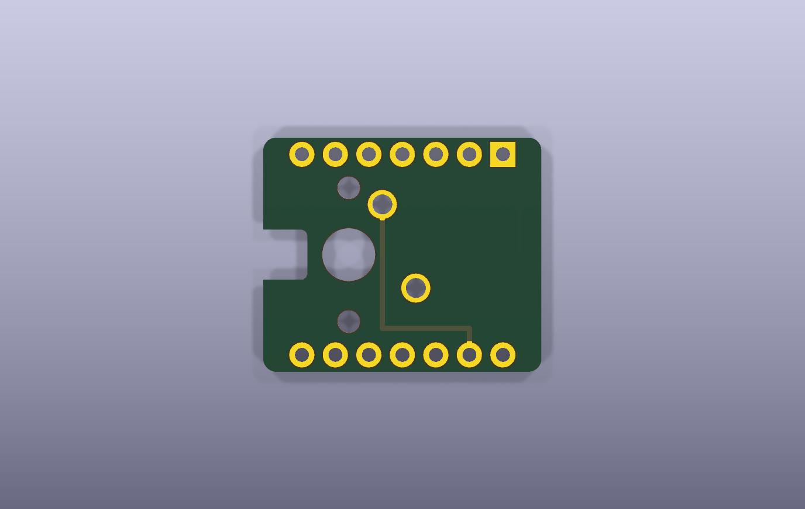
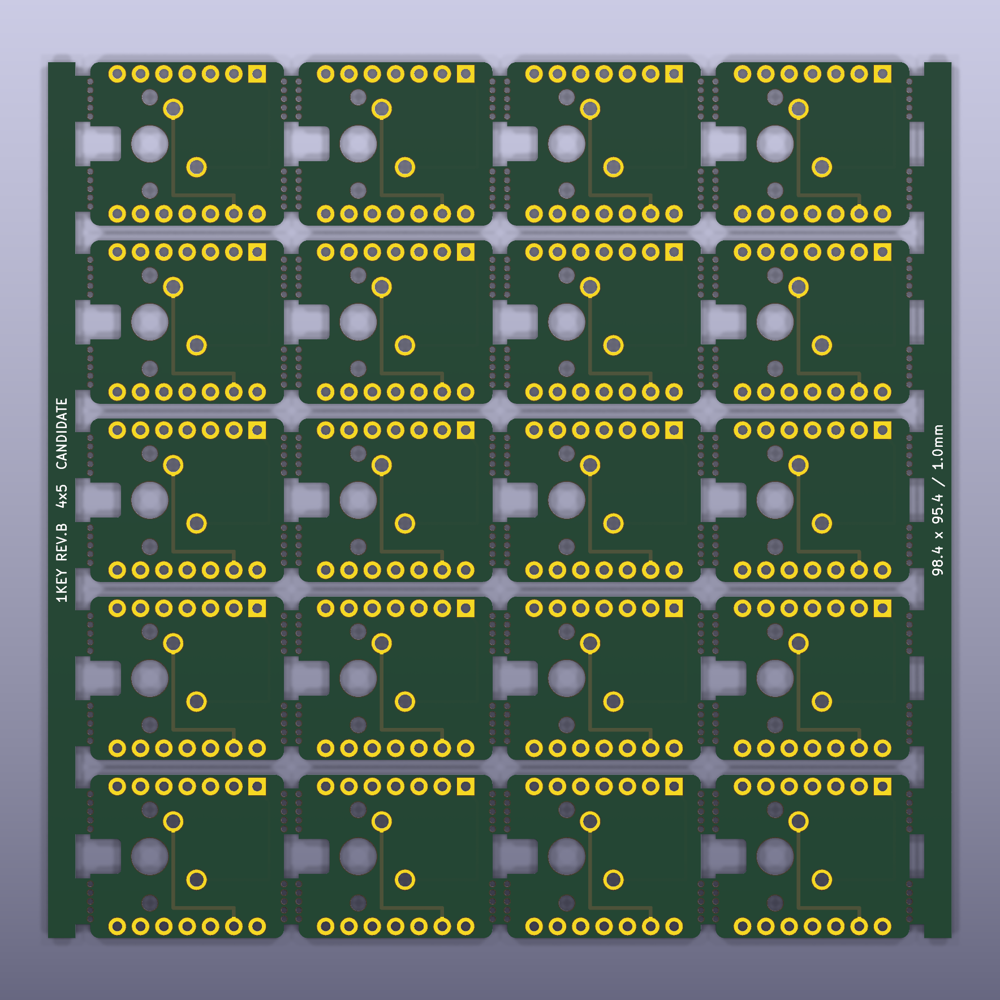
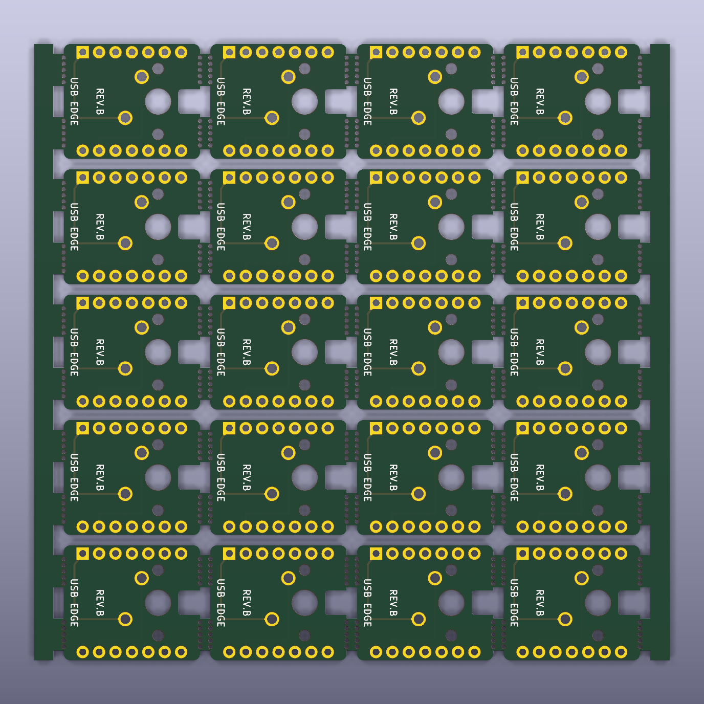

# OneKey Gaming Keyboard PCB for XIAO RP2040

[日本語](#日本語) | [English](#english)

## 日本語

### 概要

Seeed Studio XIAO RP2040とPCBマウント式の5ピンMXスイッチを上下に重ねる、1キーUSBゲーミングキーボード専用のKiCad基板設計です。

上側のキャリア基板をXIAO RP2040と同じ位置に重ね、XIAOに搭載されているRGB LEDの光軸をMXスイッチの光窓へ合わせます。キャリア基板に外付けLEDは搭載せず、XIAOの内蔵RGB LEDを利用します。

本プロジェクトでは基板の製造と実装まで行っています。ただし、部品メーカーや製造ロットによる寸法差があるため、再製造するときは後述の注意事項を確認し、最初に少数で試作してください。



### 専用ファームウェア

この基板は、次のファームウェアリポジトリと組み合わせて使用できます。

**[onekey-gaming-keyboard-xiao-rp2040](https://github.com/tsurumakishunta/onekey-gaming-keyboard-xiao-rp2040)**

専用ファームウェアを書き込むと、次のように動作します。

- MXスイッチを1回押すと、USBキーボード入力として `arigatou` を1回送信します。
- 日本語IMEがローマ字入力になっている場合、通常は「ありがとう」と入力されます。
- Enterキーは送信しません。
- XIAO RP2040の内蔵RGB LEDが、7色の滑らかなグラデーションで光り続けます。

この基板だけではUSBキーボードとして動作しません。XIAO RP2040へのファームウェア書き込みが必要です。

### 基板の構造

- 下側：部品面を上にしたSeeed Studio XIAO RP2040
- 上側：MXスイッチを取り付ける積層キャリア基板
- XIAO側：1列7ピンのメスソケットを2本
- キャリア基板側：1列7ピンのオスヘッダーを2本
- スイッチ：PCBマウント式の標準5ピンMX互換スイッチ
- USB-C端子：XIAO RP2040の端子をそのまま使用

不透明な下部ハウジングのMXスイッチでは、XIAOのRGB LEDの光がキーへ届きません。RGB対応の透明または半透明ハウジングを持つスイッチと、光を通すキーキャップを使用してください。

この設計はホットスワップソケットには対応しておらず、手はんだを前提としています。MX Low Profile、Kailh Choc、光学式、磁気式スイッチ用の基板ではありません。

### 回路

回路は、MXスイッチをXIAO RP2040のD0とGNDの間に接続するシンプルな構成です。

```text
XIAO pin 1  D0 / GPIO26 ---- SW1 pad 1
XIAO pin 13 GND ----------- SW1 pad 2
```

ファームウェアがXIAOの内部プルアップ抵抗を有効にするため、キャリア基板上に外付け抵抗、ダイオード、コンデンサー、LEDはありません。

ヘッダー穴とMXスイッチの接点穴はスルーホールメッキされています。MXスイッチの中央・左右の固定穴と、面付け基板のミシン目は非メッキ穴です。

### 単体基板の仕様

| 項目 | 仕様 |
|---|---:|
| リビジョン | Rev.B |
| 外形寸法 | 21.10 × 17.80 mm |
| 層数 | 2層 |
| 基板厚 | 1.00 mm |
| 材質 | FR-4 |
| 銅厚 | 1 oz想定 |
| 角 | R1.00 mm |
| MXスイッチ | PCBマウント式5ピン、1U |
| スイッチ入力 | D0 / GPIO26、押下時GND |

基板厚は、積層高さとMXスイッチの固定形状を考慮して **1.00 mm** を前提にしています。1.60 mmへ変更する場合は、ヘッダーのかみ合わせ、MXスイッチの固定爪、端子の突出量、XIAO上の部品との干渉を改めて確認してください。

### 4×5面付け基板

JLCPCBなどへまとめて発注できるように、単体基板を20枚配置したミシン目付きパネルを収録しています。





| 項目 | 仕様 |
|---|---:|
| 配列 | 4列 × 5行 |
| 取得できる単体基板 | 20枚 |
| パネル外形 | 98.40 × 95.40 mm |
| 単体基板ピッチ | 22.70 × 19.40 mm |
| ルーター溝 | 1.60 mm |
| 左右レール | 3.00 mm |
| タブ幅 | 5.00 mm |
| ミシン目 | 1列につき5穴、穴径0.60 mm、ピッチ0.95 mm |

部品を付けた状態で基板を折ると、スイッチ、ヘッダー、はんだ部へ大きな力がかかります。必ず基板を切り離し、端面を整えてから部品を実装してください。

### JLCPCB向け製造データ

アップロード用Gerber ZIPは次の場所にあります。

[`fabrication/onekey_revb_4x5_panel_JLCPCB.zip`](fabrication/onekey_revb_4x5_panel_JLCPCB.zip)

```text
SHA-256: E2092C8DA0B966CC4B055C34EE1AFF2BCEEBEC182B71E3D3F318ED53CC495E65
```

主な想定設定は次のとおりです。

- 2層、FR-4、1.00 mm、1 oz
- 面付け済み／Customer Panel
- 異なるデザイン数：1
- 4列 × 5行
- JLCPCBによる自動面付け：なし
- Vカット：なし
- PCBA：なし（自分ではんだ付け）

発注画面の名称や料金条件は変更される場合があります。アップロード後に検出寸法が **98.40 × 95.40 mm**、層数が2層であることを確認し、Gerberビューアで20枚すべての外形、光学ノッチ、配線、スルーホール、ミシン目を確認してください。面付けやルーター加工による追加料金が発生する可能性もあります。

### 組み立て時の注意

1. 4×5パネルを単体基板へ切り離し、ミシン目の端面を整えます。
2. キャリア基板の下面へオスヘッダーを取り付け、上面側ではんだ付けします。
3. 上面に残る端子がMXスイッチへ干渉しないよう、必要に応じて安全に処理します。
4. XIAO RP2040の部品面へメスソケットを取り付けます。
5. ヘッダーの向き、USB-C側、RGB LEDとMX光窓の位置を確認してからMXスイッチをはんだ付けします。
6. 導通と短絡がないことを確認してからXIAOを接続します。
7. 専用ファームウェアを書き込み、最初は空のテキストエディターで動作を確認します。

USBへ接続する前に、D0とGNDの短絡、隣接ヘッダーピン間のはんだブリッジ、XIAO上の部品とMX端子の接触がないことをテスターで確認してください。

### 検証と制限事項

- KiCad 10のERC：違反0件
- 単体基板のKiCad 10 DRC：違反0件、未接続0件
- 4×5パネルのKiCad 10 DRC：違反0件、未接続0件
- Gerber ZIP：銅箔2層、ソルダーマスク2層、シルク2層、外形、PTH・NPTHドリルを収録

ERCとDRCは、設計へ登録された電気的・二次元的な製造ルールを検査するものです。コネクターの実際の挿入深さ、基板間の高さ、MXスイッチ端子とXIAO部品のクリアランス、RGB光軸、キーキャップ、3Dプリントケースとの組み合わせまでは保証しません。使用する部品の現物で確認してください。

### KiCadで開く

KiCad 10以降で、次のプロジェクトファイルを開きます。

- 単体基板：[`hardware/revb_stacked/onekey_stacked_rev_b.kicad_pro`](hardware/revb_stacked/onekey_stacked_rev_b.kicad_pro)
- 4×5面付け：[`hardware/revb_panel/onekey_revb_4x5_panel.kicad_pro`](hardware/revb_panel/onekey_revb_4x5_panel.kicad_pro)

プロジェクト固有のシンボルとフットプリントは各ディレクトリの `libraries/` に含まれ、ライブラリテーブルは `${KIPRJMOD}` を使用した相対パスになっています。

### ファイル構成

```text
.
├── hardware/
│   ├── revb_stacked/       単体基板の回路図・PCB・プロジェクト内ライブラリ
│   └── revb_panel/         4×5面付けPCB・プロジェクト内ライブラリ
├── fabrication/            JLCPCBアップロード用Gerber ZIPとSHA-256
├── docs/images/            KiCadで生成した説明用レンダー
├── LICENSES/               第三者ライセンス
├── THIRD_PARTY_NOTICES.md  第三者データの出典と変更内容
├── LICENSE                 本プロジェクト独自部分のライセンス
└── README.md
```

### ライセンス

本プロジェクト独自部分はMIT Licenseです。プロジェクト内シンボルとフットプリントには、Seeed StudioおよびKiCad公式ライブラリを基に変更した部分が含まれます。詳細は [`THIRD_PARTY_NOTICES.md`](THIRD_PARTY_NOTICES.md) と `LICENSES/` を参照してください。

---

## English

### Overview

This repository contains the KiCad design files for a dedicated one-key USB gaming keyboard PCB. A PCB-mount five-pin MX switch is stacked directly above a standard Seeed Studio XIAO RP2040. The optical opening of the switch is aligned with the XIAO onboard addressable RGB LED, so no external LED is fitted to the carrier PCB.

The project has reached physical PCB fabrication and hand assembly. Component dimensions can still vary by manufacturer and production lot, so verify the actual switch, headers, sockets, keycap, and enclosure before ordering more than a small prototype quantity.


### Firmware

Use this PCB with the dedicated firmware repository:

**[onekey-gaming-keyboard-xiao-rp2040](https://github.com/tsurumakishunta/onekey-gaming-keyboard-xiao-rp2040)**

The firmware types `arigatou` once per press, does not send Enter, and continuously animates the XIAO onboard RGB LED through a smooth seven-color gradient. With a Japanese IME in romaji mode, the typed text will usually appear as `ありがとう`. The PCB does not operate as a USB keyboard until firmware has been installed on the XIAO RP2040.

### Electrical design

```text
XIAO pin 1  D0 / GPIO26 ---- SW1 pad 1
XIAO pin 13 GND ----------- SW1 pad 2
```

The firmware enables the internal pull-up. The carrier has no external resistor, diode, capacitor, or LED.

### Board specifications

- Single carrier: 21.10 × 17.80 mm, two-layer FR-4, 1.00 mm finished thickness
- Switch: PCB-mount five-pin 1U MX-compatible switch with a translucent RGB-capable lower housing
- Panel: 4 × 5 array, 20 boards, 98.40 × 95.40 mm
- Routed gaps: 1.60 mm; side rails: 3.00 mm; breakaway tabs: 5.00 mm
- Mouse bites: five 0.60 mm NPTH holes per row at 0.95 mm pitch
- Assembly: hand soldering after depanelization; hot-swap sockets are not supported


### JLCPCB fabrication package

The upload-ready Gerber archive is [`fabrication/onekey_revb_4x5_panel_JLCPCB.zip`](fabrication/onekey_revb_4x5_panel_JLCPCB.zip).

```text
SHA-256: E2092C8DA0B966CC4B055C34EE1AFF2BCEEBEC182B71E3D3F318ED53CC495E65
```

The intended baseline is a two-layer, 1.00 mm FR-4, 1 oz, customer-panelized PCB with one identical design arranged in four columns and five rows. Do not request automatic panelization, V-cuts, or PCBA. Verify the detected 98.40 × 95.40 mm dimensions and inspect every layer and drill file in the online Gerber viewer before ordering. Service labels, capabilities, and prices may change.

### Validation and limitations

KiCad 10 ERC and DRC pass with zero violations for the single-board project, and panel DRC passes with zero violations and zero unconnected pads. These checks validate only the encoded electrical and two-dimensional manufacturing rules. They do not guarantee connector insertion depth, board-to-board height, clearance to XIAO components, the optical path through a particular MX switch, keycap fit, or enclosure fit. Verify those items with the exact physical parts you intend to use.

Open the single-board project at [`hardware/revb_stacked/onekey_stacked_rev_b.kicad_pro`](hardware/revb_stacked/onekey_stacked_rev_b.kicad_pro) or the panel project at [`hardware/revb_panel/onekey_revb_4x5_panel.kicad_pro`](hardware/revb_panel/onekey_revb_4x5_panel.kicad_pro) using KiCad 10 or later.

### License

Original project material is released under the MIT License. Some project-local symbols and footprints contain modified material based on the Seeed Studio and official KiCad libraries. See [`THIRD_PARTY_NOTICES.md`](THIRD_PARTY_NOTICES.md) and `LICENSES/` for their source and license terms.
